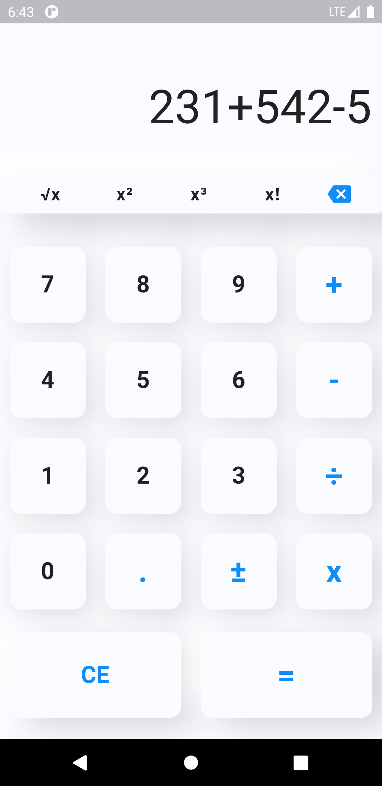

# Flutter Neumorphic Calculator
This is an fully functional Flutter calculator, with Neumorphic effect buttons and
display. This app also have the functionality to calculate square, cube, factorial, square-root of a value and also can do multiple operation on a single line.
 
### Languages & tools :
[][android]
[][dart]
[][flutter]
  

| Neumorphic Flutter Calculator |
|------|
||

### Directory Structure :
    |-- calculator_flutter
    |    |-- android
    |    |
    |    |-- ios
    |    |
    |    |-- lib
    |    |   |-- screen_page.dart
    |    |   |-- constant.dart
    |    |   |-- export.dart
    |    |   |-- main.dart
    |    |
    |    |-- pubspec.lock
    |    |-- pubspec.yaml
    |
    |-- Img
    |    |-- androidstudio.png
    |    |-- dart.png
    |    |-- flutter.png
    |    |-- flutterCalculator.png
    |
    |-- README.md

## Connect with me:  

  
 

[website]: https://abhilashtuofficial.github.io/
[dart]: https://github.com/AbhilashTUofficial/CloneApps
[flutter]: https://github.com/AbhilashTUofficial/CloneApps
[android]: https://github.com/AbhilashTUofficial/CloneApps

